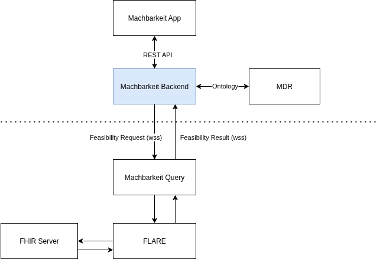

# 🦾 machbarkeit-backend

[](https://github.com/diz-unimr/machbarkeit-backend/actions/workflows/mega-linter.yml)
[](https://github.com/diz-unimr/machbarkeit-backend/actions/workflows/build.yaml)
[](https://github.com/diz-unimr/machbarkeit-backend/actions/workflows/release.yaml)
[](https://codecov.io/gh/diz-unimr/machbarkeit-backend)


> Backend service for the Machbarkeit Web App

This service implements the Backend for frontend (BFF) pattern. It serves as dedicated backend for the Machbarkeit Web
app in order to provide:

- Ontology data via the MDR service (configured)
- (Asynchronous) Feasibility request execution

## Ontology

Ontology data is proxied through the MDR service (see API)

## Feasibility requests

Feasibility request handling is done asynchronously.<br/>
Clients can send feasibility requests via the API endpoint `/feasibility/request` (see API below). If accepted (202),
the backend provides the result url in the `Location`-Header of the response.

This url can then be polled for the feasibility result which will return a 404 response if the result is not yet
available (poll again!) or the actual result otherwise.

### Broker scenario

This supports request execution against data repositories in protected networks that are not directly accessible from
the backend.<br />
In this scenario the backend serves as a broker that delegates incoming requests from the frontend. A request execution
service (see [machbarkeit-query](https://github.com/diz-unimr/machbarkeit-query)) connected via websocket can execute
the request against a data repository and send the feasibility result back to the broker (i.e. the backend).
The persisted request is then updated with the result data and can be obtained by the frontend with a request to
`/feasibility/request/{id}`.

**Example deployment:**



### Format

Feasibility requests are represented in the
[structured query](https://github.com/num-codex/codex-structured-query/blob/main/structured-query/documentation/2021_01_29StructeredQueriesDocumentation(Draft).md)
format which is also used by the [FLARE](https://github.com/medizininformatik-initiative/flare/blob/main/docs/api.md)
service.

## Backend API

> [!NOTE]
> Endpoints are protected via OIDC. Authentication is supported via Authorization Code flow (see `/login`) or Bearer
> token with an Access token obtained from the Identity Provider (confidential client).

Protected endpoints can be accessed with a **Session cookie** (public clients) or **Bearer token** (confidential)

#### Authentication

<details>
 <summary><code>GET</code> <code><b>/login</b></code> <code>(login to obtain a session cookie)</code></summary>

##### Parameters

> None

##### Body

> None

##### Responses

> | http code | header                                       | response            |
> |-----------|----------------------------------------------|---------------------|
> | `200`     |                                              |                     |
> | `307`     | _On success:_ `Set-Cookie: {session cookie}` | `(Redirect to IDP)` |

##### Example cURL (with token)

> ```sh
>  curl -X GET http://localhost:3000/login
> ```

</details>

------------------------------------------------------------------------------------------

#### Feasibility

> [!IMPORTANT]
> Authentication required

<details>
 <summary><code>POST</code> <code><b>/feasibility/request</b></code> <code>(create a feasibility request)</code></summary>

##### Parameters

> None

##### Body

> | content-type          | data type             | required |
> |-----------------------|-----------------------|----------|
> | `application/sq+json` | Structured query (sq) | true     |

##### Responses

> | http code | content-type               | header                       | response                                                 |
> |-----------|----------------------------|------------------------------|----------------------------------------------------------|
> | `203`     |                            | `Location: {request (uu)id}` |                                                          |
> | `503`     | `text/plain;charset=UTF-8` |                              | _No feasibility service subscribed to execute the query_ |

⚠️ The actual feasibility result can be obtained by polling the endpoint returned by the `Location`-Header. Currently,
requests are not accepted if no execution service is connected via websocket.

##### Example cURL (with token)

> ```sh
>  curl -X POST -H "Authorization: Bearer {access token}" http://localhost:3000/feasibility/request
> ```

</details>

<details>
 <summary><code>GET</code> <code><b>/feasibility/request/{id}</b></code> <code>(get a feasibility result by id)</code></summary>

Request execution is asynchronous. If the result isn't available yet, this will return a `404`.
All other responses are returned as is from the feasibility request execution service.

##### Parameters

> | name |  type      | data type      | description                            |
> |------|------------|----------------|----------------------------------------|
> | `id` |  required  | string         | The request's unique identifier (uuid) |

##### Body

> None

##### Responses

> | http code                                                      | content-type               | response                                              |
> |----------------------------------------------------------------|----------------------------|-------------------------------------------------------|
> | `200`                                                          |                            | FeasibilityRequest                                    |
> | `404`                                                          |                            |                                                       |
> | <code>503</code><br /><code>504</code><br /><code>500</code> | `text/plain;charset=UTF-8` | Delegated error response from the feasibility service |

##### Example cURL (with token)

> ```sh
>  curl -X GET -H "Authorization: Bearer {access token}" http://localhost:3000/feasibility/request/00000000-0000-0000-0000-000000000000
> ```

</details>

**Feasibility websocket (wss)**

<summary><code><b>/feasibility/ws</b></code> <code>(subscribe to incoming feasibility requests)</code></summary>

------------------------------------------------------------------------------------------

#### Metadata repository (MDR) API

> [!IMPORTANT]
> Authentication required

See [mdr-service REST API](https://github.com/diz-unimr/mdr-service?tab=readme-ov-file#rest-endpoints)

## Configuration properties

Application properties are read from a properties file ([app.yaml](./app.yaml)) with default values.

| Name                      | Default                 | Description                                                        |
|---------------------------|-------------------------|--------------------------------------------------------------------|
| `log_level`               | info                    | Log level (error,warn,info,debug,trace)                            |
| `base_url`                | <http://localhost:3000> | Base url of the backend (i.e. _this_ service)                      |
| `auth.oidc.client_id`     |                         | OIDC Client id                                                     |
| `auth.oidc.client_secret` |                         | OIDC Client secret                                                 |
| `auth.oidc.issuer_url`    |                         | OIDC Issuer url                                                    |
| `cors.allow_origin`       |                         | Sets the _Access-Control-Allow-Origin_ header for CORS requests    |
| `session.lifetime`        | 86400 _(1 day)_         | Sets the session cookie's _Max-Age_ property                       |
| `session.cross_domain`    | false                   | Enable / disable Cross domain cookies                              |
| `mdr.endpoint`            |                         | Endpoint of the MDR service for the `/mdr` endpoints (see MDR API) |

### Environment variables

Override configuration properties by providing environment variables with their respective property names. Replace `.`
with double underscore (`__`).

### Example deployment

Docker compose:

```yaml
backend:
image: ghcr.io/diz-unimr/machbarkeit-backend:1.2.10
environment:
  LOG_LEVEL: debug
  BASE_URL: http://localhost:3000
  AUTH__OIDC__ISSUER_URL: https://idp/auth/realms/Machbarkeit
  AUTH__OIDC__CLIENT_ID: machbarkeit
  AUTH__OIDC__CLIENT_SECRET: ${CLIENT_SECRET}
  CORS__ALLOW_ORIGIN: https://other-host.local,https://yet-another-host.local
  SESSION_LIFETIME: 3600 # 1 hour
  SESSION__CROSS_DOMAIN: true
  MDR__ENDPOINT: https://mdr-service
ports:
  - "3000:3000"
```

## License

[AGPL-3.0](https://www.gnu.org/licenses/agpl-3.0.en.html)
